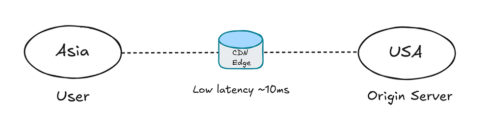
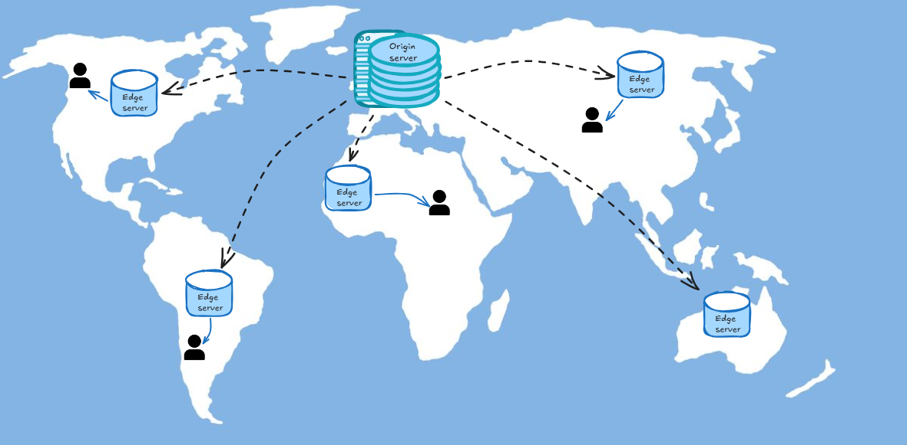
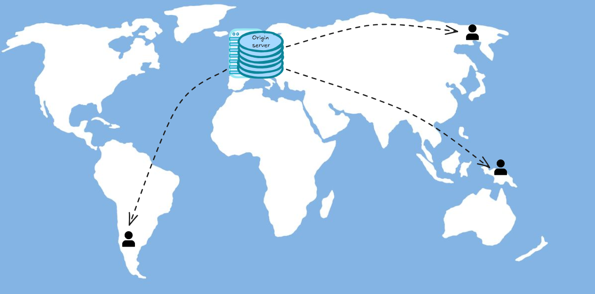
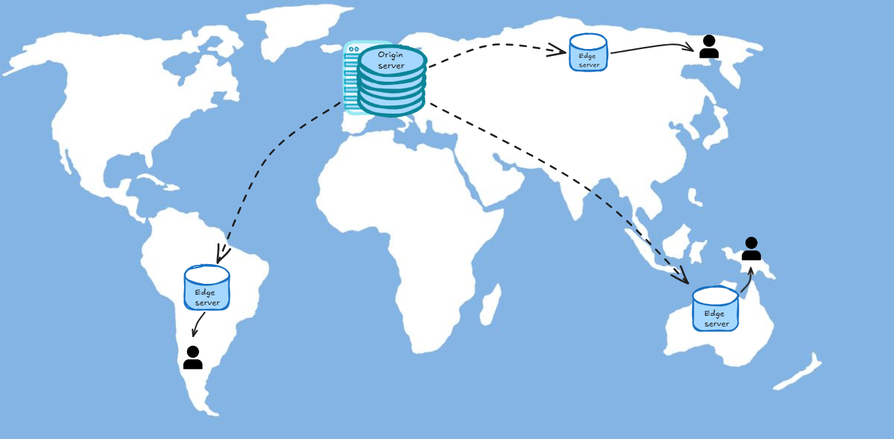
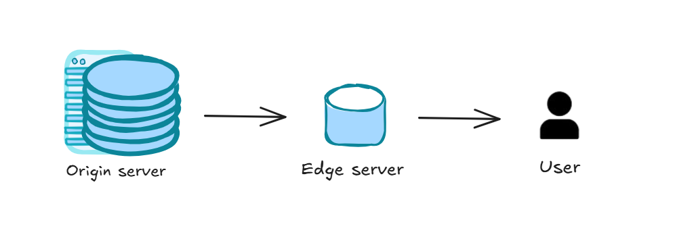
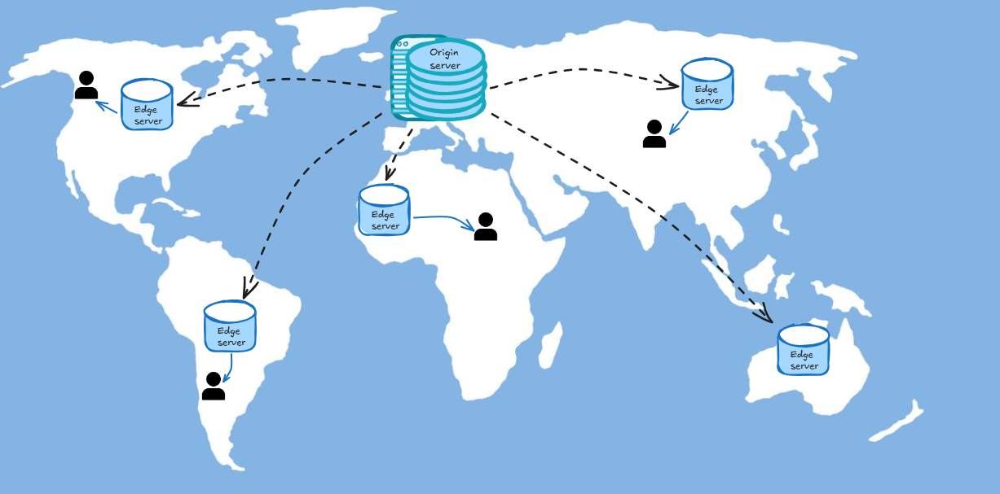
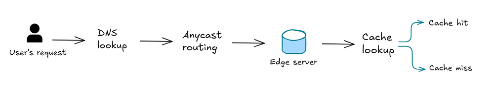
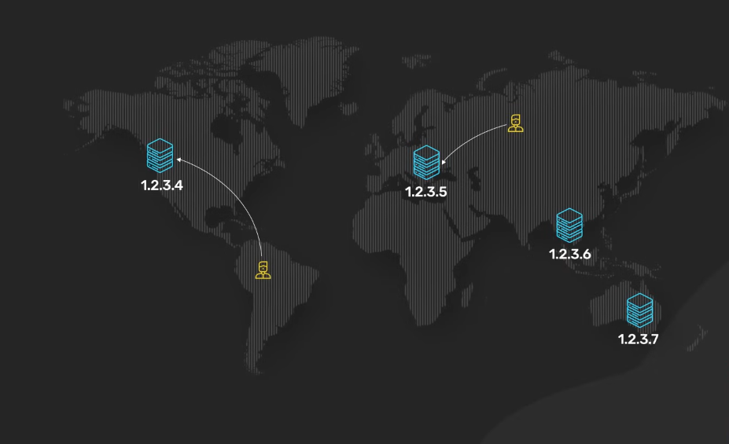
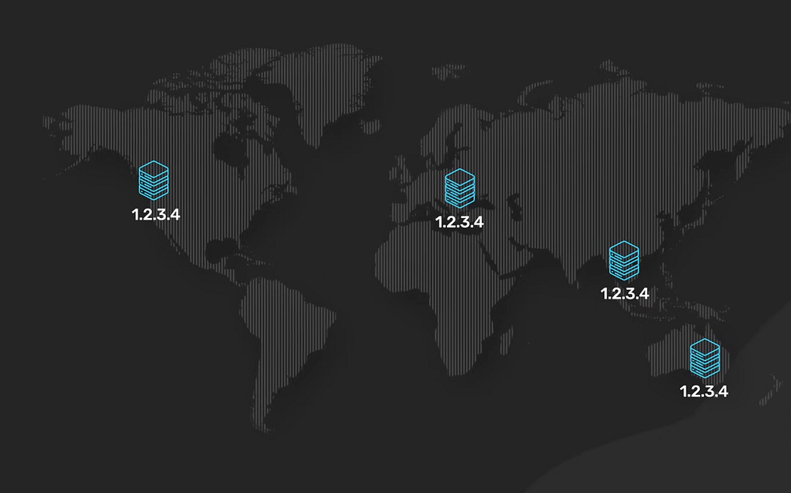
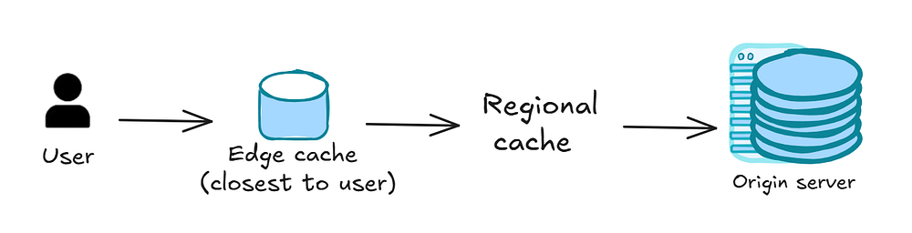

# Speeding Up the World: An Easy Guide to CDNs

## Introduction 

The internet connects billions of users across the world, all expecting websites and applications to load instantly. However, it became hard to do so after the evolution of the internet and the amount of users increasing more and more. When content is served from a single centralized server, every request must travel across long distances and multiple network hops. As the distance grows, latency and the time required for data to travel across networks increases and the infrastructure struggles to scale efficiently for global demand.

*For example*, imagine a user in **Asia** trying to access a web application hosted in **Europe**. Each request for a page, image or video must cross thousands of kilometers, often resulting in slow load times or buffering. 

Instead of relying on a single origin server to serve every user, CDNs were developed to distribute content across a global network of servers by caching copies of frequently requested data at locations closer to users, which reduces the distance data must travel, latency and improves load times. This distributed architecture allows websites and applications to scale efficiently while maintaining fast and reliable delivery.

## The Problem: Distance, Latency and Scalability

In the early internet, websites were hosted on single servers in one geographic location. As the web grew globally and traffic increased, users far from those servers often experienced slow loading times and reliability issues. As we can see, **latency** plays a critical role in performance in modern web. 

Every time a user requests a webpage, image or video, the data must travel across multiple networks between the user's device and the server hosting the content. The farther the server is from the user, the longer this journey becomes, increasing the delay before the content can be delivered.

At the same time, web services must handle traffic from users distributed across the world. Relying on a single centralized server means that all requests converge on the same infrastructure, which can quickly become overwhelmed as demand grows. Several factors contribute to this problem such as : 

- **Network latency** : each request passes through multiple routers, networks and infrastructure layers before reaching the destination.
- **Geographic distance** : data must physically travel across long distances due to how far users and server can be from one another.
- **Increasing traffic** : as the number of users grows, centralized servers can become overloaded leading to congestion and slower responses.


This combination of physical distance, network congestion, and limited server capacity makes it difficult for traditional centralized architectures to deliver fast and reliable experiences to users around the world.



## What is a CDN?

*CDN : content delivery network*

A **CDN (Content Delivery Network)** is a group of servers spread out over many locations. These servers store duplicate copies of data so that servers can fulfill data requests based on which servers are closest to the respective end-users. Instead of serving every request directly from a single origin server, a CDN replicates and caches content across a globally distributed set of servers, often called **edge servers** or **Points of Presence (PoPs)**.



CDNs are used widely for delivering stylesheets and JavaScript files **(static assets)** of libraries like Bootstrap, jQuery etc. Using CDN for those library files is preferable for a number of reasons:

- Serving libraries' static assets over CDN lowers the request burden on an organization's own servers.
- Most CDNs have servers all over the globe, so CDN servers may be geographically nearer to your users than your own servers. Geographical distance affects latency proportionally.
- CDNs are already configured with proper cache settings. Using a CDN saves further configuration for static assets on your own servers.

When a user requests a resource such as a webpage, image, video, or API response, the request is routed to the nearest edge server in the CDN network. If the content is already cached there, it can be delivered immediately, significantly reducing latency and improving load times. If the content is not available, the edge server retrieves it from the origin server, stores it temporarily, and serves it to the user.

## With / Without CDN :

By bringing content closer to users, CDNs reduce the distance data must travel across the network, lowering latency and improving responsiveness. In addition to performance improvements, modern CDNs also provide capabilities such as traffic optimization, security protections and edge computing, making them a fundamental component of modern internet infrastructure.

| Feature         | Without CDN            | With CDN     |
| --------------- | ---------------------- | ------------ |
| Latency         | High for distant users | Low globally |
| Server Load     | Heavy on origin        | Distributed  |
| Scalability     | Limited                | Massive      |
| DDoS Protection | Weak                   | Strong       |


Without a CDN, every user request has to travel all the way to the origin server which increases latency and slows page load times for users far from the server.



With a CDN, content is cached at edge servers closer to the user, dramatically reducing delays and delivering pages almost instantly.



## CDN vs Traditional Hosting

It is important to understand how CDNs differ from traditional hosting models when designing scalable and high-performance systems.

| Feature                | Traditional Hosting                        | CDN                                       |
| ---------------------- | ------------------------------------------ | ----------------------------------------- |
| Architecture           | Centralized (single server or data center) | Distributed across global edge servers    |
| Content Delivery       | All requests go to the origin server       | Content served from nearest edge location |
| Latency                | High for distant users                     | Low due to geographic proximity           |
| Scalability            | Limited, prone to bottlenecks              | Highly scalable, load distributed         |
| Reliability            | Single point of failure                    | Redundant, multiple edge locations        |
| Performance Under Load | Degrades during traffic spikes             | Handles spikes efficiently                |
| Availability           | Downtime affects all users                 | Failover across multiple locations        |
| Security               | Basic                                      | Advanced (WAF, DDoS protection)           |

## Evolution of CDNs

In the late 1990s, companies like Akamai introduced Content Delivery Networks as internet traffic began to grow rapidly and traditional web infrastructure struggled to deliver content efficiently to users around the world.

Early CDN solutions focused mainly on distributing static assets such as images, scripts and media files across geographically distributed servers to reduce latency and improve load times. Later on, web applications became more dynamic and user demand increased, They began incorporating advanced traffic routing, improved caching mechanisms, and support for modern web protocols to optimize performance at scale.

```
1990s                  Early 2000s                    2010s–Today
+----------------+    +-----------------+       +----------------------------+
| Static Content | -> | Dynamic Content |  ->   |Security, Traffic Mgmt,     |
| (images, JS,   |    | & Smart Caching |       | & Edge Computing at Scale  |
| media files)   |    | Protocol Support|       |                            |
+----------------+    +-----------------+       +----------------------------+

```

Today, CDNs play a much broader role in internet infrastructure. Beyond accelerating content delivery, they provide security services, traffic management and programmable edge computing capabilities making them a core component of modern web architecture.


## CDN Architecture


A CDN is built on a distributed architecture designed to bring content closer to users while maintaining a centralized source of truth. At the core of this architecture is the **origin server**, which stores the original version of the website's content. Instead of every user request being served directly from the origin, the CDN distributes content through a network of **edge servers** located in multiple geographic regions.



These edge servers are organized into **Points of Presence (PoPs)**, which are physical data center locations strategically placed around the world. Each PoP contains multiple caching servers responsible for storing and delivering content to nearby users with minimal latency.

Behind this infrastructure, CDNs typically separate their systems into two logical layers : 

- the **data plane** : handles user requests and content delivery in real time
- the **control plane** : manages configuration, routing policies, caching rules and network coordination across the entire CDN. 



This architecture allows CDNs to scale globally while maintaining high performance and reliability.

## CDN Request Lifecycle

When a user requests content from a website that uses a CDN, the request goes through several steps before the content is delivered :

 First, the browser performs a **DNS lookup** to resolve the website's domain name and determine which CDN network should handle the request. The request is then routed through the internet, often using **Anycast routing** which directs it to the nearest available CDN edge server.



CDN request lifecyclethe DNS resolves the domain to an IP address, and Anycast routing directs the request to the nearest edge server for faster delivery.

Once the request reaches the edge server, the CDN performs a **cache lookup** to check whether the requested content is already stored locally. If the content is found in the cache **(a cache hit)**, it is immediately returned to the user, providing a fast response. If the content is not available **(a cache miss)**, the edge server retrieves it from the origin server, stores a temporary copy in its cache, and then delivers it to the user.

## DNS and Traffic Steering

*DNS : domain name system*

**DNS** plays a crucial role in directing users to the most appropriate CDN edge server. When a browser requests a website, the DNS system resolves the domain name to an IP address, but in a CDN this IP often points to the CDN network rather than the origin server. Advanced CDNs use **geo-aware DNS** and other routing techniques to guide users to the edge server that can deliver content fastest and most reliably.

Traffic steering can consider factors such as :

- Geographic proximity.
- Network latency.
- Server load.
- Availability.



By dynamically adjusting which edge server handles each request, CDNs ensure optimal performance, balance traffic across the network, and provide redundancy in case of server or regional outages. This intelligent routing is a core component of modern CDN efficiency.

## Anycast Routing


**Anycast routing** is a network technique used by CDNs to ensure that user requests are automatically directed to the nearest edge server. Unlike traditional unicast, where a single IP corresponds to one server, in Anycast multiple servers share the same IP address. The network infrastructure, using **BGP (Border Gateway Protocol)**, routes each request to the geographically or topologically closest server advertising that IP.



*This approach provides several advantages: it reduces latency by minimizing the distance data travels, improves reliability through automatic failover, and balances traffic across multiple servers without manual configuration.*

## Caching in CDNs


**Caching** is the foundation of CDN performance. Instead of fetching content from the origin server for every request, CDN edge servers store copies of frequently requested resources closer to users. When a user requests a resource, the **edge server** checks its cache and, if the content is available, delivers it immediately. 

Most CDNs use a **multi-layer caching system**, with edge caches near users, regional caches serving multiple edge locations, and the origin server as the source of truth.


 
Techniques such as **time-to-live (TTL), cache purging**, and **validation** help keep content fresh while maintaining high performance. By intelligently caching content, CDNs can efficiently handle large traffic volumes and deliver data quickly across the globe.

| Concept            | Description                                               |
| ------------------ | --------------------------------------------------------- |
| Cache Hit          | Requested content is already stored in the edge cache     |
| Cache Miss         | Content is not cached and must be fetched from the origin |
| TTL (Time-To-Live) | Duration content remains cached before expiration         |
| Cache Purge        | Manual removal of cached content                          |
| Cache Validation   | Checking if cached content is still up-to-date            |

## Static vs Dynamic Content Delivery

*CDNs handle **static** and **dynamic** content differently to optimize performance* 

- **Static content** : images, videos, stylesheets and scripts. 

Can be easily cached on edge servers because it does not change frequently. Serving static assets from nearby edge locations significantly reduces latency and improves load times for users.

- **Dynamic content** : personalized pages, API responses, or real-time data, is generated on demand and often cannot be fully cached. 

Modern CDNs accelerate dynamic content by optimizing network paths, reusing connections, compressing data and sometimes executing logic at the edge to reduce round trips to the origin server.
 
## HTTP Caching and Headers

CDNs rely on **HTTP caching headers** to determine how content should be stored, served, refreshed. These headers instruct browsers and CDN edge servers how long resources can be cached and when they need to be validated with the origin server

- **Cache-Control** : defines caching policies like max-age, no-cache, or public/private, specifying whether content can be stored and for how long.

- **Expires** : defines a specific expiration date for cached content.

- **ETag** and **Last-Modified** : allow the CDN and browser to verify whether cached content is still valid using conditional requests.

By interpreting these headers, CDNs can manage cache freshness, reduce origin requests, and deliver content with minimal latency while ensuring users receive up-to-date information.

### example :

```
Cache-Control: public, max-age=3600
Expires: Wed, 18 Mar 2026 12:00:00 GMT
ETag: "abc123"
Last-Modified: Tue, 17 Mar 2026 11:30:00 GMT
```

## Cache Invalidation and Content Freshness


Maintaining up-to-date content in a CDN cache is essential for ensuring users always see the latest version of a website or application. 

**Cache invalidation** is the process of removing or updating cached content when it becomes outdated. Without proper invalidation, users may receive stale data, which can lead to broken functionality or incorrect information.

CDNs provide several strategies to manage content freshness :
- **Time-to-live (TTL)** settings automatically expire cached objects after a specified period. 

- **Manual purges** allow developers to remove specific content immediately

- **cache versioning** uses unique identifiers in URLs to signal updates.

## Cache Eviction Policies

CDNs have limited storage on edge servers, so they must decide which cached content to keep and which to remove when space runs out. **Cache eviction policies** define these rules to optimize performance and ensure frequently requested content remains available.

Common strategies include:
- **LRU (Least Recently Used)**: Removes content that has not been accessed recently.

- **LFU (Least Frequently Used)**: Removes content that is requested less often.

- **TTL based eviction**: Automatically expires content after a predefined time-to-live.

- **Hybrid approaches**: Combine multiple strategies for more intelligent cache management.

by this, CDNs maintain high cache hit rates, reduce origin load, and continue delivering content quickly even under high traffic conditions.

## Origin Shielding 

To protect origin servers and improve cache efficiency, many CDNs use an **origin shield** a designated server that sits between edge caches and the origin. When an edge server experiences a cache miss, the request is routed to the shield server first, rather than going directly to the origin.


The shield consolidates requests from multiple edge servers, fetching content from the origin only once when needed. 

## Consistency Trade-offs in Distributed Caching

In a distributed CDN, ensuring that all edge servers have the most up-to-date content can be challenging. **Consistency trade-offs** arise because frequently updating content across many caches can increase latency and network load, while less frequent updates risk serving stale data to users.

Techniques such as **cache versioning** and **conditional requests** help maintain content accuracy without significantly impacting performance. Understanding these trade-offs is essential for delivering content that is both fast and reliable at global scale.

## Performance Optimization Techniques

CDNs use a variety of techniques to improve content delivery speed and overall user experience. These include **compression** of text and media files to reduce payload size, **image and video optimization** to serve the most efficient formats, and **connection reuse** through persistent TCP connections to minimize handshake overhead.

Other strategies include **prefetching content** that users are likely to request next, **minifying code** such as JavaScript and CSS, and **adaptive content delivery** that adjusts based on device type or network conditions. By combining these optimizations, CDNs reduce latency, lower bandwidth consumption, and ensure faster, more reliable delivery of both static and dynamic content.

### Transport Protocol Optimization

CDNs improve performance by using advanced transport protocols that reduce latency and increase reliability. Traditional HTTP/1.1 can be inefficient due to multiple sequential requests and connection overhead. Modern CDNs leverage **HTTP/2**, which multiplexes multiple requests over a single connection, and **HTTP/3** (built on QUIC), which reduces handshake times and handles lossy networks more efficiently.

Other optimizations include **TCP connection reuse, TLS session resumption, packet loss mitigation.**

## Security Capabilities of CDNs

Modern CDNs act as a security layer between users and origin servers, helping protect infrastructure while maintaining performance. They provide **TLS termination**, handling encryption and decryption at the edge to reduce load on the origin and ensure secure connections.

CDNs also include **Web Application Firewalls (WAFs)** to filter malicious traffic, **bot management** to block automated abuse and **rate limiting** to prevent excessive requests from affecting availability. **Malicious requests** are inspected at the edge using **filtering rules**, **threat signatures**, and **behavioral analysis**. 

For **HTTP traffic**, CDNs often enforce HTTPS by redirecting users to secure connections, while still monitoring and filtering non-secure requests to maintain safe content delivery.

These security measures protect against common threats such as SQL injection, cross-site scripting, and credential stuffing, all while ensuring fast and reliable content delivery.

### DDoS Mitigation

CDNs play an important role in protecting websites from **Distributed Denial of Service (DDoS) attacks**, which attempt to overwhelm servers with massive amounts of traffic. By distributing content across a global network of edge servers, CDNs can **absorb and filter attack traffic** before it reaches the origin server.

Advanced mitigation strategies include :

- **traffic scrubbing**, where malicious requests are identified and dropped.

- **rate limiting** to control excessive requests.

- **automatic rerouting** to healthy servers in case of localized attacks.

 This allows websites and applications to remain available and performant even during large-scale attacks, providing resilience against one of the most common threats to online services.

## Edge Computing

Edge computing extends the capabilities of CDNs content delivery by allowing code and applications to run directly on **edge servers**. This enables processing closer to the user, reducing the need to communicate with the origin server for every request.

### edge function example : 
```
export default {
  async fetch(request) {
    return new Response("Hello from the edge!");
  }
}
```

## Observability and Monitoring

Effective CDN management depends on strong **observability and monitoring** to maintain performance, reliability and security. CDNs provide detailed metrics and logs such as cache hit ratios, request latency, bandwidth usage, and error rates giving operators visibility into how content is delivered across the network.

Advanced monitoring systems can track **regional performance, detect anomalies, and identify potential bottlenecks or attacks.** By analyzing this data in real time, teams can optimize caching strategies, adjust traffic routing, and ensure a consistent, high-quality user experience.

### an example of CDN logs :

```
{
  "timestamp": "2026-03-17T12:34:56Z",
  "client_ip": "192.168.1.5",
  "cache_status": "HIT",
  "response_time_ms": 12
}
```

## CDN Use Cases

CDNs are used across a wide range of industries and applications to improve performance, scalability, and reliability. 

 - **Websites and web applications:** Faster loading of pages and static assets to users worldwide. 
 - **E-commerce:** Improved shopping experience with fast product pages, secure transactions, and better handling of traffic spikes.
 - **Media & Streaming:** Smooth video, music, and game delivery with reduced buffering.
 - **Gaming:** Low latency for real-time interactions and faster game updates/downloads.
 - **APIs & Cloud Services:** Faster API responses and efficient delivery of dynamic content.
 - **Software Distribution:** Reliable delivery of large files such as updates and installers.

*Overall, any application that requires fast, reliable, and global content delivery can benefit from a CDN.* 

## Major CDN providers

Choosing a CDN provider depends on factors such as global reach, security features, performance optimization and integration with existing infrastructure.

- **Akamai** was one of the first CDN providers and remains a leader with a vast network of edge servers worldwide. 

- **Cloudflare** is known for its security focused services, including DDoS mitigation and Web Application Firewall (WAF) combined with fast content delivery.
 
- **Fastly** specializes in real-time content delivery and edge computing, offering highly programmable edge services.

Other notable providers include **Amazon CloudFront** which integrates seamlessly with AWS services, **Microsoft Azure CDN, Google Cloud CDN** and smaller specialized networks that focus on video streaming, gaming or regional performance.
 
## Limitations and Trade-offs

While CDNs provide significant performance, scalability, and security benefits, they also involve certain **limitations and trade-offs :**

 - **Cache Staleness:** Cached content may become outdated if not properly invalidated, leading to inconsistencies for users.
 - **Dynamic Content Challenges:** Highly dynamic or personalized content is harder to cache efficiently.
 - **Complexity:** Deploying and configuring CDN infrastructure requires technical expertise.
 - **Cost:** Operating at global scale can introduce additional costs, especially for high traffic volumes.
 - **Third-party Dependency:** Relying on external CDN providers may reduce control over infrastructure and limit flexibility.

## The Future of CDNs

The role of CDNs is rapidly evolving beyond traditional content delivery, driven by growing performance demands and new technologies.

**Edge computing** is becoming a key part of this evolution, enabling applications to run logic, personalization, and real-time processing directly at edge servers. This reduces latency and offloads work from origin infrastructure.

CDNs are also integrating **AI-driven optimization**, including predictive caching and intelligent traffic routing to further improve performance and reliability.
 
In addition, emerging capabilities such as **serverless edge functions, edge databases, enhanced security and privacy features** are transforming CDNs into fully programmable platforms that combine delivery, computation and protection at the network edge.

## Conclusion
 
**Content Delivery Networks** have become a fundamental part of modern internet infrastructure, addressing key challenges such as latency, scalability, and reliability. By distributing content across globally located edge servers, CDNs reduce the distance between users and data, improving load times and easing the burden on origin servers.

As web applications continue to grow in complexity and user expectations for speed and reliability increase, **CDNs** will remain a critical layer for delivering fast, secure and resilient digital experiences worldwide.

## Resources :
 
- [What is a CDN? How does it work? | Akamai](https://share.google/PxINtYFSyN47EY31z)

- [What is a Content Delivery Network? | Cloudflare ](https://share.google/0W1gcmNjn6KpKSh7I)

- [What is CDN | Fastly ](https://share.google/KpnvncQXmZt4OAyFu)

- [How DNS works  ](https://wizardzines.com/zines/dns/)

- [Qu'est ce qu'un CDN? | Glossaire - MDN ](https://developer.mozilla.org/fr/docs/Glossary/CDN)

- [Cache Control Header - HTTP | MDN ](https://developer.mozilla.org/en-US/docs/Web/HTTP/Reference/Headers/Cache-Control)


## Authored by

**Maya Otsmane** in collaboration with the **Development Department**.

