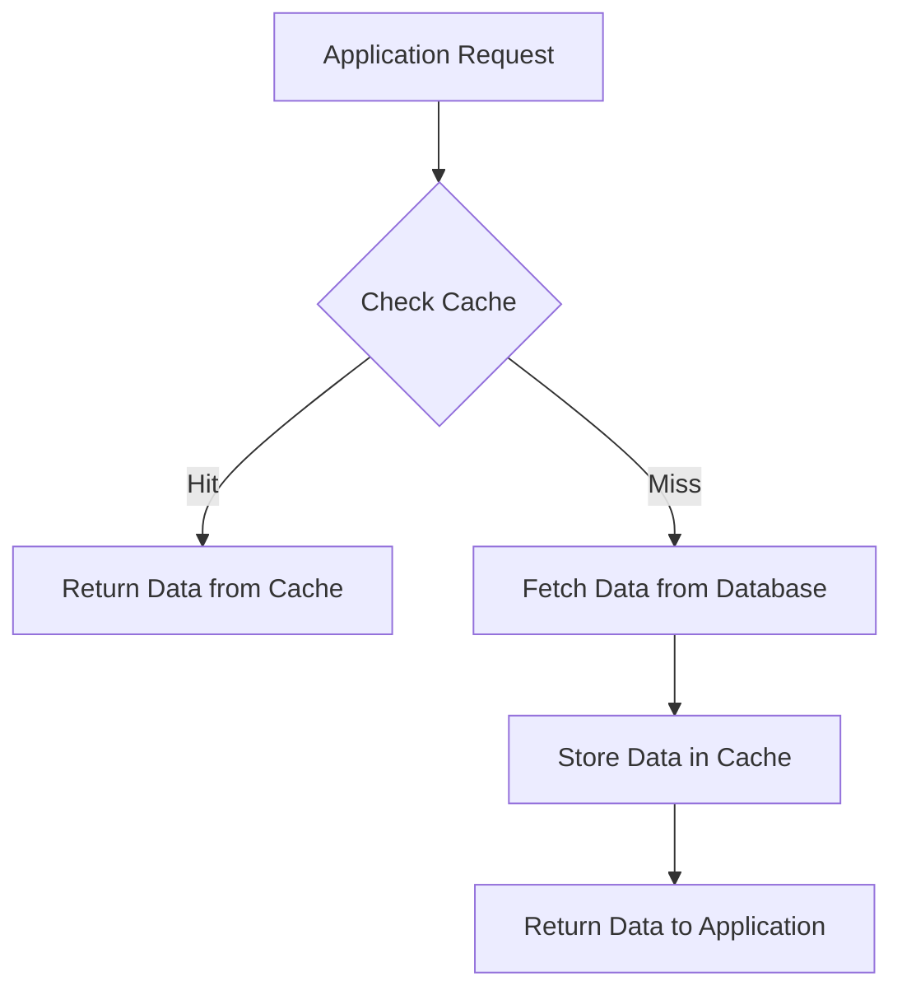
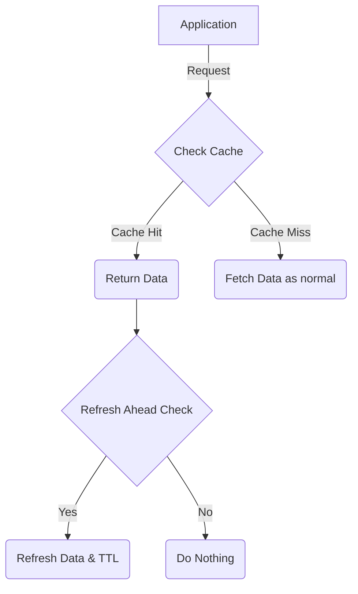
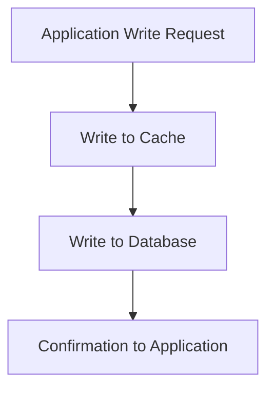
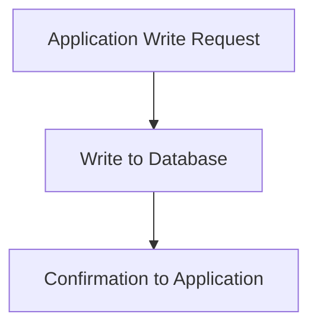
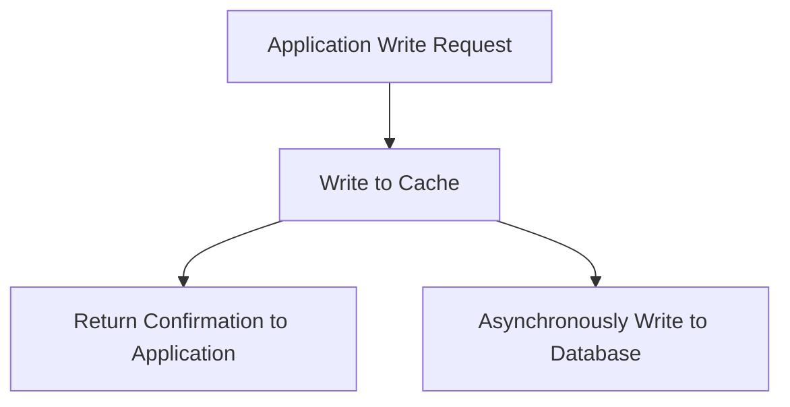

# The Complete Guide to Caching: Speed Up Your Applications

_Understanding caching strategies, implementation patterns, and best practices for modern software systems_

---

Imagine having to walk to a filing cabinet across the room every time you need a phone number. Exhausting, right? That's exactly what your application does when it repeatedly fetches the same data from a database. **Caching** is like keeping a notepad on your desk—you jot down frequently needed information so you can access it instantly without the trip.

In modern applications, data retrieval from databases or external services can be painfully slow due to network latency, I/O operations, or computational complexity. Caching solves this by storing frequently accessed data in a fast storage layer, allowing applications to respond to repeated requests in microseconds rather than milliseconds.

## Why Caching Matters

Caching isn't just about speed—it transforms your entire system architecture:

**Lower Latency:** Accessing data from cache is orders of magnitude faster than querying a database or external service.

**Reduced Backend Load:** Fewer database queries mean less server strain and better resource utilization.

**Cost Savings:** Reduced computation and I/O operations translate directly to lower infrastructure costs.

**Enhanced User Experience:** Users get faster responses and smoother interactions, leading to better engagement and satisfaction.

---

## Types of Caches: Choosing the Right Tool

The implementation of caching depends on who needs access to the data and where it's stored. Here are the main types:

### 1. In-Memory Cache

In-memory caches store data directly in the RAM of a server or application process, enabling extremely fast access times often measured in microseconds. However, RAM is volatile—data will be lost if the process restarts.

**Best for:** Session storage, configuration settings, computed results, frequently accessed product data

**Trade-off:** Speed vs. persistence

### 2. Distributed Cache

Distributed caches span multiple servers or nodes, making them ideal for scalable applications where multiple service instances need to share the same cached data. Popular solutions include Redis and Memcached.

**Best for:** Large-scale e-commerce sites, social media feeds, multi-server web applications

**Trade-off:** Complexity vs. scalability

### 3. Client-Side Cache

Client-side caching stores data on the user's device—whether in a browser or mobile application. This reduces network calls and improves performance for frequently accessed resources.

**Best for:** API responses, static assets, user preferences

**Trade-off:** Storage limitations vs. reduced network calls

---

## Building an In-Memory Cache: The Core Components

Creating an effective in-memory caching system requires careful decisions about several key components. Let's explore each one.

### Loading Strategies: Getting Data Into Cache

#### Cache-Aside (Lazy Loading)

The most common loading strategy follows a simple pattern:

1. Application requests data
2. Check if data exists in cache
3. If not, fetch from database and store in cache
4. Return data to application

**Advantage:** The cache only contains data that's actually being used—no wasted memory on unused data.

**Disadvantage:** First request always results in a cache miss.

#### Refresh-Ahead

This advanced strategy solves a critical problem with TTL-based caches: popular data points still get invalidated when their TTL expires, causing temporary performance degradation.

**How it works:**

1. Set a `refresh-ahead-factor` between 0 and 1 (e.g., 0.8)
2. On each data access, check if: `Current_TTL < Original_TTL × refresh_ahead_factor`
3. If true, asynchronously refresh the data and reset its TTL

**Advantage:** Popular data never goes stale—users always get cache hits.

**Disadvantage:** Increased complexity and background refresh operations.

### Writing Strategies: Keeping Cache and Database in Sync

How you handle writes is crucial for maintaining data consistency.

#### Write-Through

Updates both cache and database synchronously.

**Advantage:** Strong consistency—cache and database are always in sync.

**Disadvantage:** Slower writes due to dual operations.

**Best for:** Systems where data accuracy is critical and stale data is unacceptable.

#### Write-Aside (Write-Around)

Writes only go to the database, bypassing the cache entirely.

**Advantage:** Cache isn't polluted with data that may never be read.

**Disadvantage:** Immediate cache miss if data is read right after writing (read-after-write pattern).

**Best for:** Write-heavy workloads where most data is only written, not read.

#### Write-Behind (Write-Back)

Writes go to cache immediately, while database writes are queued and processed asynchronously during periods of lower load.

**Advantage:** Extremely fast writes and excellent for high-availability scenarios where data is frequently accessed after being written.

**Disadvantage:** Risk of data loss if the application crashes before the batch is processed to the database.

**Best for:** High-throughput systems with eventual consistency requirements.

### Eviction Policies: Managing Limited Memory

When your cache reaches capacity, you need a strategy to decide what gets removed.

#### LRU (Least Recently Used)

Evicts the data that hasn't been accessed for the longest time.

**Assumption:** Data that's been reused recently will likely be reused again soon.

**Best for:** General-purpose caching where recent access patterns predict future access.

#### LFU (Least Frequently Used)

Evicts data that has been accessed the least number of times.

**Assumption:** Data that isn't accessed frequently is less valuable.

**Best for:** Systems where some data is consistently popular while other data is rarely needed.

#### FIFO (First In, First Out)

Removes the oldest entries first, regardless of access patterns.

**Assumption:** Data is most valuable immediately after it enters the cache.

**Best for:** Linear workflows where data follows a predictable lifecycle.

#### Random Eviction

Randomly selects and removes an entry.

**Assumption:** No particular access pattern exists, and speed of eviction matters more than optimization.

**Best for:** Simple systems where memory management overhead should be minimal.

### Invalidation Strategies: Keeping Data Fresh

Cache invalidation ensures that stale data doesn't persist when the underlying data changes.

#### Manual Invalidation

When the application updates the database, it explicitly updates or removes the corresponding cache entry.

**Advantage:** Direct control over cache consistency.

**Disadvantage:** Heavier write operations and tight coupling between application logic and cache management.

#### TTL-Based Invalidation

Each cache entry has a Time To Live (TTL). When the TTL expires, the entry is automatically invalidated and removed.

**Advantage:** Simple to implement and allows controlled staleness.

**Disadvantage:** Data might be stale for the duration of the TTL, and popular data gets invalidated unnecessarily.

**Best for:** Systems where slightly stale data is acceptable (e.g., product catalogs, news feeds).

#### Event-Based Invalidation

The cache is invalidated whenever a write occurs in the database.

**Advantage:** Strong consistency between cache and database.

**Disadvantage:** Tight coupling between database and cache systems.

**Best for:** Systems requiring real-time accuracy.

---

## Making Smart Caching Decisions

### Assess Your Consistency Requirements

First, determine whether your system requires strong consistency or can tolerate stale data.

**Strong consistency needed?** Use write-through caching with event-based invalidation.

**Eventual consistency acceptable?** Use write-behind caching with TTL-based invalidation for better performance.

### Identify Read-Heavy vs. Write-Heavy Workloads

A common mistake is treating your entire system as one monolithic data type. In reality, different data has different access patterns.

**Example:** In a document platform like Google Docs:

- **Document text:** High-write workload (users constantly editing)
- **Document metadata:** High-read workload (displayed on every page load)

**Solution:** Only cache the metadata. Write-heavy workloads aren't suitable for caching because data gets invalidated too quickly to provide value.

### Know When NOT to Cache

Caching isn't always the answer. Avoid caching when:

**High-write workloads:** If your system receives more writes than reads, caching adds complexity without providing benefits.

**Small systems:** If your application is simple and not under performance pressure, caching adds unnecessary complexity.

**Low reuse:** If data is accessed only once or twice in its lifetime, the overhead of caching exceeds the benefits.

---

## Measuring Cache Performance

You can't improve what you don't measure. Track these key metrics:

### Cache Hit Rate

Shows the overall effectiveness of your cache.

**Formula:** `(Cache Hits / Total Requests) × 100`

**Target:** Generally aim for 80%+ for read-heavy workloads.

### Cache Miss Rate

Indicates how often requests bypass the cache and hit the database.

**Formula:** `(Cache Misses / Total Requests) × 100`

**What to watch:** Sudden spikes might indicate cache invalidation issues or capacity problems.

### Eviction Rate

Shows how often items are being evicted.

**Formula:** `Number of Evictions / Time Period`

**What to watch:** High eviction rates suggest the cache is undersized or the eviction policy isn't optimal.

### Data Freshness

Measures how far behind the cache is from the source of truth.

**Formula:** `Current Time - Last Update Time`

**What to watch:** Increasing age indicates the system isn't keeping up with updates.

---

## Key Takeaways

Caching is a powerful tool when applied correctly:

1. **Choose the right cache type** for your architecture—in-memory for speed, distributed for scale, client-side for reducing network calls.

2. **Match strategies to workload**—use cache-aside for read-heavy workloads, write-through for strong consistency needs, write-behind for high-throughput systems.

3. **Select appropriate eviction policies**—LRU for general use, LFU for predictable access patterns, FIFO for linear workflows.

4. **Monitor relentlessly**—track hit rates, miss rates, and eviction rates to optimize performance continuously.

5. **Don't over-cache**—recognize when caching adds complexity without providing value.

Remember, caching is like that notepad on your desk—incredibly useful when you need quick access to frequently used information, but it requires thoughtful organization and regular maintenance to remain effective. Start simple, measure everything, and iterate based on real-world performance data.
